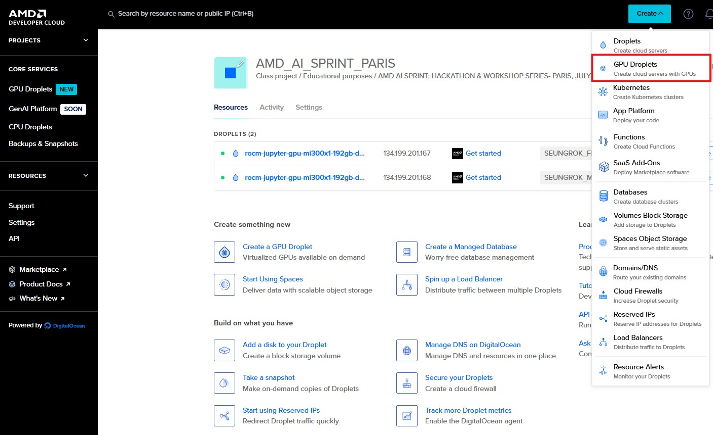
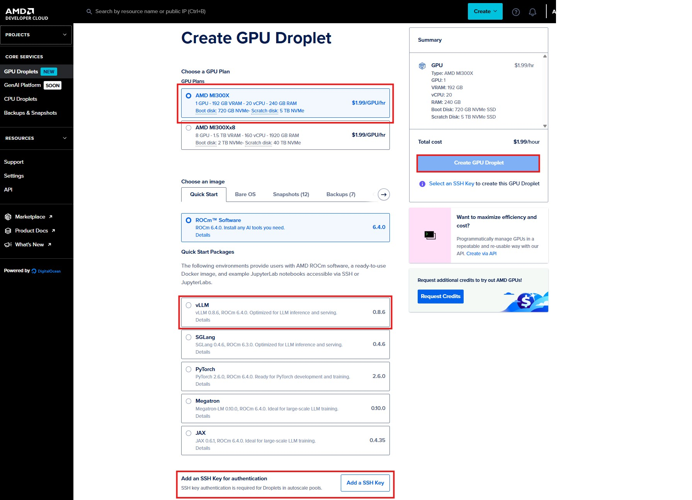
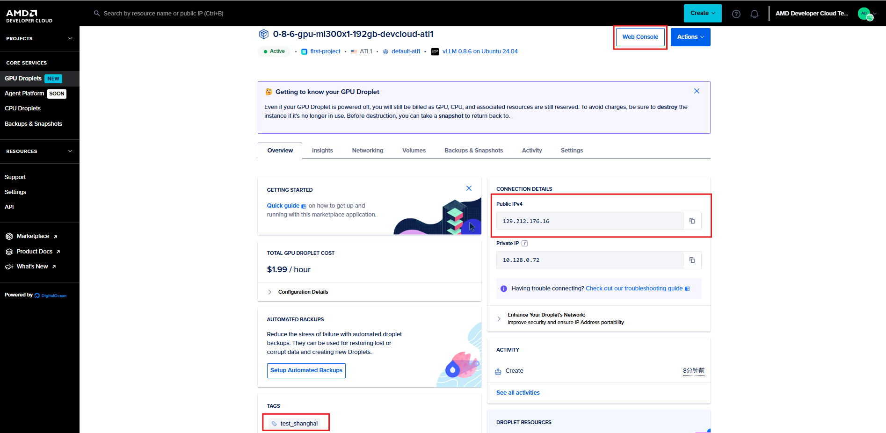
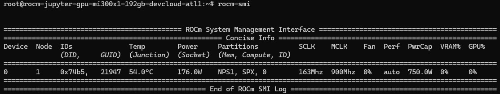

# Dev Cloud quick start

## ⭐ Step 0
- Login to the dev cloud
  
https://amd.digitalocean.com/partnerships/amd/campaigns/6c80e114-4a66-407c-9bef-8d9a6c485ef6?activation_redirect=http

## ⭐ Step 1
- Click GPU Droplets

 
## ⭐Step 2
- Select AMD MI300X (1 GPU)
- Choose an image (vLLM image)
- Add your SSH public key and select your key
- Click "Create GPU Droplet"


## ⭐Step 3
- Please add TAGs with your name to easily identify your instance
- Check out SSH IP or web console


## ⭐Step 4: Docker Launch
- Make sure you selected "vLLM Image" also check if TAGS is correctly applied
- Open a terminal and access the instance IP along with PORTs to connect to the instance

```sh
# for example, ssh root@129.212.176.203
ssh root@YOUR_OP
```
- Check out GPU status by "rocm-smi"


Now navigate to 🏃‍➡️ [hackathon_start](https://github.com/danielhua23/ai_sprint_shanghai/tree/main/hackathon_guides/1_developing_vllm)
