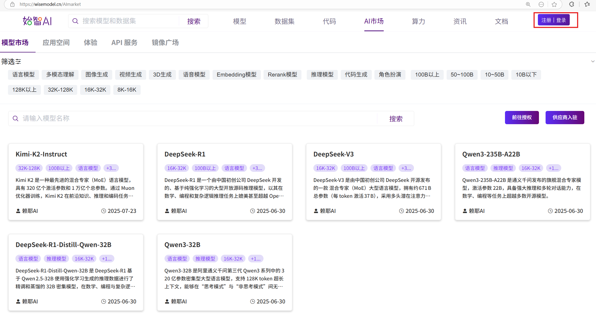
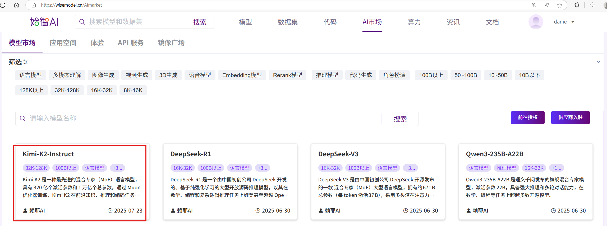
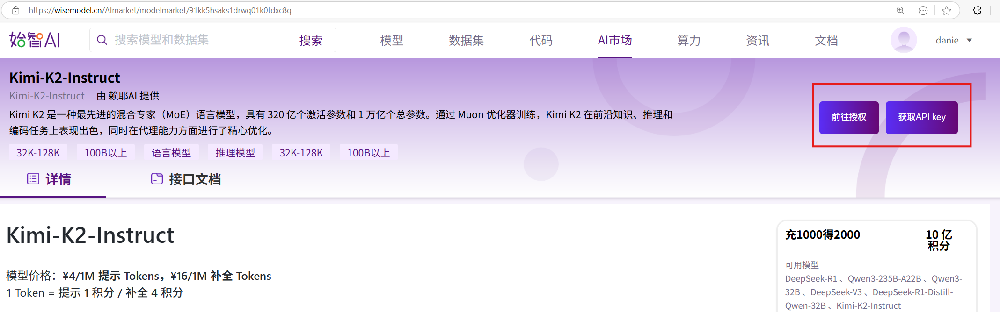
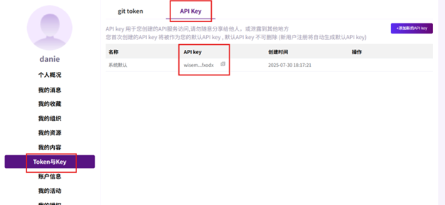

# 进入wisemodel AI market

https://wisemodel.cn/AImarket

# 注册登录

点击右上角注册账号并登录

# 点击kimi-k2-instruct

# 前往授权并获取API key

先后点击前往授权和获取API key后即可获得访问kimi-k2-instruct的API key

# API key所在位置

点击右上角的头像，进入用户中心，点击Token与key和API key后，即可显示API key

