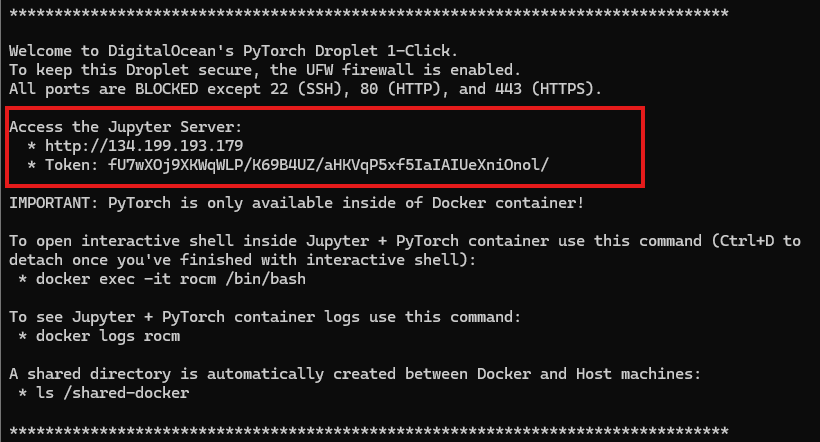

# Triton Examples

This is a jupyter notebook to show how to optimization and run triton kernels on AMD GPU.

## Launch Jupyter Server in Developer Cloud

<font size=5  color=red>
**For China Developer Meetup / Workshop event, please open a browser and directly log in with your assigned IP and token. Skip below step 1 ~ 5 !!!**
</font>

1. Log in Developer Cloud by:
    ```bash
    ssh root@ip 
    ```
    Pay attention to the information in terminal logs when you log in:
    

2. Launch ROCm Pytorch Docker by:
    ```bash
    docker exec –it rocm /bin/bash
    ```

3. Clone the repo:
    ```bash
    git clone https://github.com/danielhua23/ai_sprint_shanghai.git
    ```

4. Launch jupyter server by:
    ```bash
    jupyter server 
    ```
5. Copy and paste the address (for example: http://129.212.188.211, you can find ip in logger info in step 1)，then input the requested token (you can also find token in logger info in step 1)

## Follow the steps in notebook
Go through the steps in triton_kernel_workshop.ipynb
