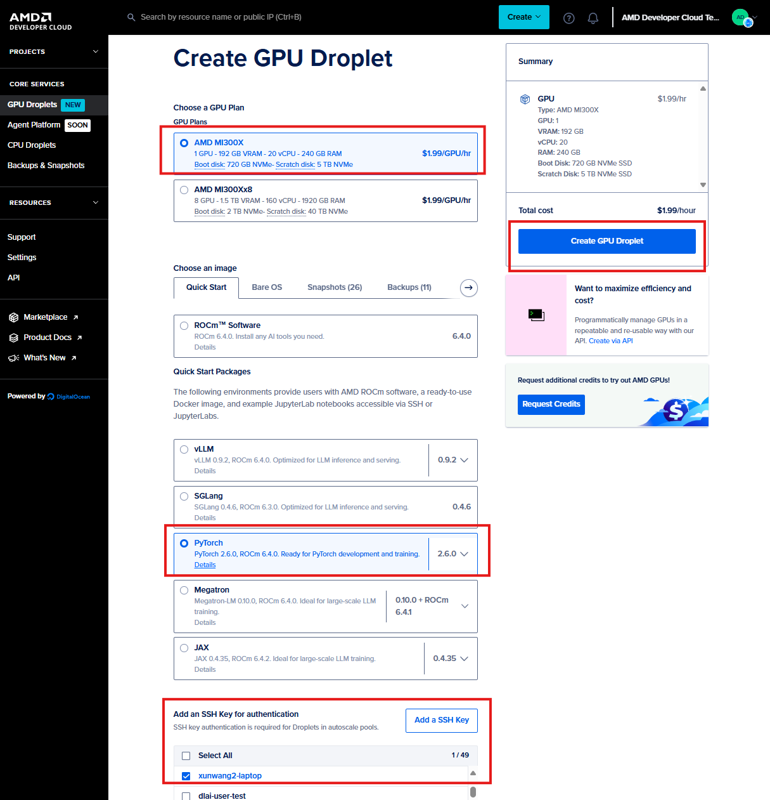

# Triton Examples

This is a jupyter notebook to show how to optimization and run triton kernels on AMD GPU.

## Launch Jupyter Server in Developer Cloud

1. Create GPU Droplet in Developer Cloud
   Create and activate GPU instance by following steps in AI_SPRINT_SHANGHAI/hackathon_guides/0_dev_cloud_manual. The only difference is this time we will select pytorch image here:
    

2. Log in Developer Cloud by:
    ```bash
    ssh root@ip 
    ```
    Pay attention to the information in terminal logs when you log in:
    

3. Launch ROCm Pytorch Docker by:
    ```bash
    docker exec –it rocm /bin/bash
    ```

4. Launch jupyter server by:
    ```bash
    jupyter server 
    ```
5. Copy and paste the address (for example: http://xxx.xxx.xxx.xxx, you can find ip in logger info when you log in developer cloud)，then input the requested token (you can also find token in logger info when you log in developer cloud)

## Follow the steps in notebook
Go through the steps in triton_kernel_workshop.ipynb
