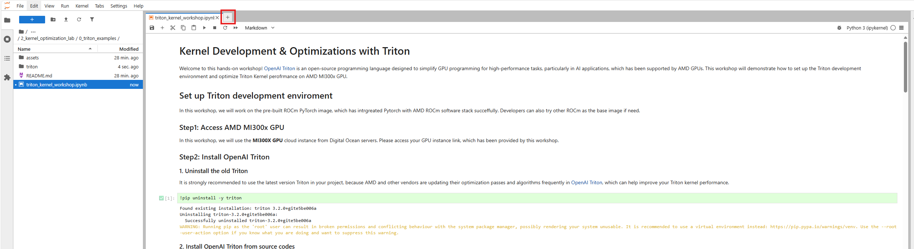
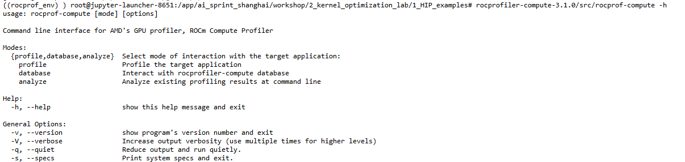
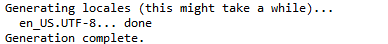

# Reduce Examples

This is a collection of HIP example codes of parallel reduce. You can build and run kernels by command line.

## Open a Terminal in Jupyterlab
1. Click "+" icon to open a terminal:
   
2. Double click the black Terminal icon:
   


## ROCm Compute Profiler Installation (Optional)

### Installation by script (RECOMMENDED)
Install the ROCm compute profiler by running this scripts:
```bash
cd /app/ai_sprint_shanghai/workshop/2_kernel_optimization_lab/1_HIP_examples/
./scripts/rocprof_compute_tool_setup.sh
```
After installation, activate the virtual environment:
```bash
source rocprof_env/bin/activate
```

### Manual Installation
Install the ROCm compute profiler manually by below steps:

1. Download prebuilts from https://github.com/ROCm/rocprofiler-compute/releases/tag/rocm-6.4.1 , by command:
    ```bash
    cd /app/ai_sprint_shanghai/workshop/2_kernel_optimization_lab/1_HIP_examples
    wget https://github.com/ROCm/rocprofiler-compute/releases/download/rocm-6.4.1/rocprofiler-compute-rocm-6.4.1.tar.gz
    ```
2. Uncompress tar file:
    ```bash
    tar xf rocprofiler-compute-rocm-6.4.1.tar.gz
    ```
3. Create and activate virtual environment:
    ```bash
    python3 -m venv rocprof_env
    source rocprof_env/bin/activate
    ```
4. Install rocprof-compute dependancies
    ```bash
    python3 -m pip install -r rocprofiler-compute-3.1.0/requirements.txt
    ```
5. Verify installation by executing the prebuilt binary:
    ```bash
    rocprofiler-compute-3.1.0/src/rocprof-compute -h
    ```
    If the installation succeed, the output will look like below:

    

6. Ensure 'en_US.UTF-8' is available on the system
   ```bash
   sudo apt update
   sudo apt install locales
   sudo locale-gen en_US.UTF-8
   ```
   If the installation succeed, the output will look like this:

   

## Build
Enter into any subfolders of `benchmark/` and build the executable, for example:

```console
cd benchmark/reduce_v0/
make
```

## Run
Enter into any subfolders of `benchmark/` and run the executable, for example:

```console
cd benchmark/reduce_v0/
./reduce_v0
```

## Profile

Profiling reduce_v0, by:
```bash
cd /app/ai_sprint_shanghai/workshop/2_kernel_optimization_lab/1_HIP_examples/benchmark/

/app/ai_sprint_shanghai/workshop/2_kernel_optimization_lab/1_HIP_examples/rocprofiler-compute-3.1.0/src/rocprof-compute profile -n reduce_v0_data -- ./reduce_v0/reduce_v0
```

Analyze reduce_v0, by:
```bash
/app/ai_sprint_shanghai/workshop/2_kernel_optimization_lab/1_HIP_examples/rocprofiler-compute-3.1.0/src/rocprof-compute analyze -p workloads/reduce_v0_data/MI300/ -o reduce_v0_profile.log
```

Profiling reduce_v1, by:
```bash
cd /app/ai_sprint_shanghai/workshop/2_kernel_optimization_lab/1_HIP_examples/benchmark/

/app/ai_sprint_shanghai/workshop/2_kernel_optimization_lab/1_HIP_examples/rocprofiler-compute-3.1.0/src/rocprof-compute profile -n reduce_v1_data -- ./reduce_v1/reduce_v1
```

Compare reduce_v0's and reduce_v1's profile data, by:
```bash
cd /app/ai_sprint_shanghai/workshop/2_kernel_optimization_lab/1_HIP_examples/benchmark/

/app/ai_sprint_shanghai/workshop/2_kernel_optimization_lab/1_HIP_examples/rocprofiler-compute-3.1.0/src/rocprof-compute analyze -p workloads/reduce_v0_data/MI300/ -p workloads/reduce_v1_data/MI300/ | tee reduce_v0_v1_compare.log
```

The profiled metrics data can be find in output log file reduce_v0_profile.log

## Reference
1. https://rocm.docs.amd.com/projects/HIP/en/latest/tutorial/reduction.html#
2. https://github.com/ROCm/rocm-examples/tree/amd-staging
3. https://github.com/gerayking/hpc_learning