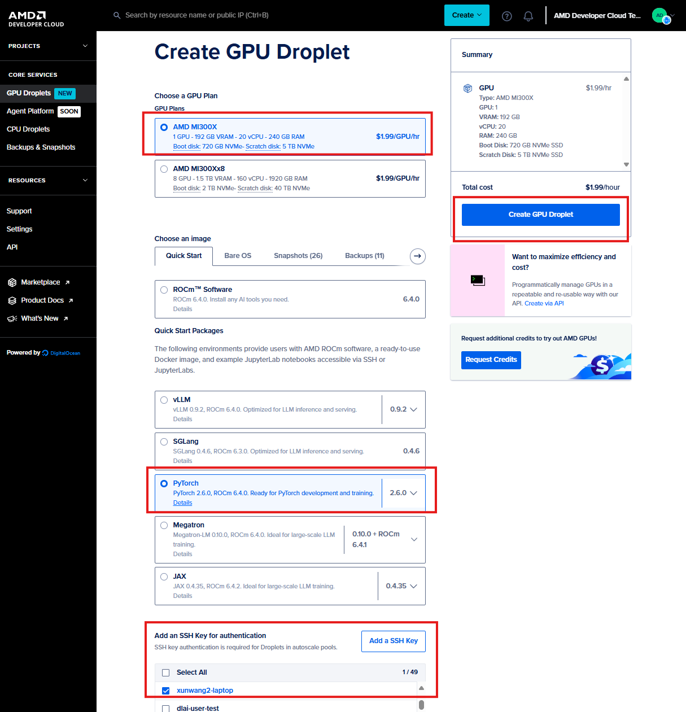

# Kernel Optimization Lab

This project helps to show how to use Triton or HIP to develop and optimize kernels on AMD's cdna GPU.

## Create GPU Droplet in AMD Developer Cloud
AMD GPUs can be accessed by AMD developer cloud, which is powered by DigitalOcean. Please finish the registration and sign in with your DigitalOcean account first.

Create and activate GPU instance by following steps in [AI_SPRINT_SHANGHAI/hackathon_guides/0_dev_cloud_manual](../../hackathon_guides/0_dev_cloud_manual/README.md)
 . The only **difference** is this time we will select **pytorch image** here:
   

## Triton kernel development
Learn how to develop triton kernels by following examples in 0_triton_examples.

## HIP kernel development
Learn how to develop HIP kernels by following examples in 1_HIP_reduce_examples.